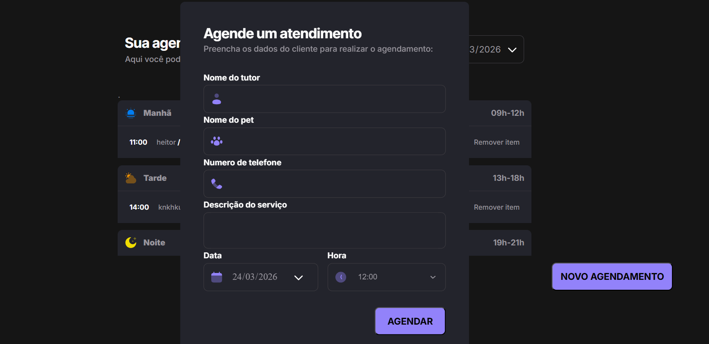

  <h1 align="center"> Petshop </h1>

  

    <a href="#-tecnologias">Tecnologias</a>&nbsp;&nbsp;&nbsp;|&nbsp;&nbsp;&nbsp;
    <a href="#-projeto">Projeto</a>&nbsp;&nbsp;&nbsp;|&nbsp;&nbsp;&nbsp;
    <a href="#memo-licença">Licença</a>
  

   

  

    
  

  ## 🚀 Tecnologias

  Esse projeto foi desenvolvido com as seguintes tecnologias:

  - HTML e CSS
  - JavaScript
  - Git e Github
  - Figma

  ## 💻 Projeto

  Esse projeto cria agendamentos para banho e tosa no petshop
  - Antes de abrir o projeto execute um "npm i" depois um "npm run server" e por fim "npm run dev"

  - [Acesse o projeto finalizado, online](https://heitorbbtc.github.io/projeto-petshop/)

  ## :memo: Licença

  Esse projeto está sob a licença MIT.

  ---

  Feito com ♥ by heitorbbtc :wave: 
